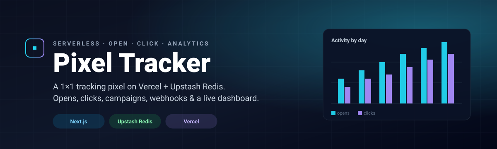

<p align="center">
  
</p>

<!-- self-tracking pixel — note: GitHub Camo proxies all README images, so
     this only ever logs Camo's IP/UA, not the real viewer. For real-IP
     signal we use the "Live demo" link above, which goes through /api/click. -->


<h1 align="center">Pixel Tracker</h1>

<p align="center">
  <b>A 1×1 tracking pixel on Vercel + Upstash Redis.</b><br/>
  Opens, clicks, campaigns, webhooks, and a live dashboard — fully serverless.
</p>

<p align="center">
  <a href="https://github.com/anujarkitekt/pixel-tracker-vercel/stargazers"></a>
  <a href="https://github.com/anujarkitekt/pixel-tracker-vercel/network/members"></a>
  <a href="https://github.com/anujarkitekt/pixel-tracker-vercel/issues"></a>
  <a href="https://github.com/anujarkitekt/pixel-tracker-vercel/blob/main/LICENSE"></a>
  
  
  
</p>

<p align="center">
  <a href="https://pixel-tracker-vercel.vercel.app/api/click?id=readme&campaign=github-readme&url=https%3A%2F%2Fpixel-tracker-vercel.vercel.app%2Fdemo" target="_blank" rel="noopener">
    
  </a>
  &nbsp;
  <a href="https://vercel.com/new/clone?repository-url=https%3A%2F%2Fgithub.com%2Fanujarkitekt%2Fpixel-tracker-vercel&env=UPSTASH_REDIS_REST_URL,UPSTASH_REDIS_REST_TOKEN&envDescription=Upstash+Redis+REST+credentials&envLink=https%3A%2F%2Fconsole.upstash.com" target="_blank" rel="noopener">
    
  </a>
</p>

---

## Why

Most email/marketing tools bury open tracking behind a paywall and a SaaS account. This is **the smallest useful version**: drop a `` tag in your email, get opens + clicks + per-campaign analytics in a dashboard you own — for the cost of a free Vercel + Upstash plan.

## Features

- **`/api/track`** — returns a 1×1 transparent PNG, logs the open
- **`/api/click`** — logs the click, then 302-redirects (open-redirect-safe: only `http`/`https` allowed)
- **Campaign tracking** — `?campaign=` param on both endpoints
- **Live dashboard** — totals, per-day chart, per-campaign breakdown, recent events with campaign filter
- **Webhooks** — set `WEBHOOK_URL` to fan out every event in real time
- **O(1) analytics** — counters maintained on write so `/api/stats` doesn't scan logs
- **Zero frontend deps** — hand-rolled SVG chart, no charting library

## Quick start

```bash
git clone https://github.com/anujarkitekt/pixel-tracker-vercel.git
cd pixel-tracker-vercel
npm install
cp .env.local.example .env.local   # optional: leave Upstash values blank to run without Redis
npm run dev
```

Open `http://localhost:3000` for the dashboard.

## Usage

**Track an email open:**
```html

```

**Track a click (wraps the destination URL):**
```html
<a href="https://your-app.vercel.app/api/click?id=user-123&campaign=spring-sale&url=https%3A%2F%2Fexample.com%2Flanding">
  Shop now
</a>
```

**Get aggregated stats:**
```bash
curl https://your-app.vercel.app/api/stats
# { totals: { track, click }, byCampaign: [...], byDay: [...] }
```

## Environment variables

| Variable | Required | Purpose |
|---|---|---|
| `UPSTASH_REDIS_REST_URL` | no | Upstash Redis REST URL — leave blank for in-memory fallback |
| `UPSTASH_REDIS_REST_TOKEN` | no | Upstash Redis REST token — leave blank for in-memory fallback |
| `WEBHOOK_URL` | no | If set, every event is POSTed here (fire-and-forget, 2s timeout) |
| `DASHBOARD_USER` | no | Basic-Auth username for `/`, `/api/logs`, `/api/stats` (default `admin`) |
| `DASHBOARD_PASSWORD` | no | Basic-Auth password. **If unset, auth is disabled.** `/api/track` and `/api/click` always stay public. |

## Architecture

```
Client (email / web)
   │
   ▼
/api/track  ──┐
/api/click  ──┼──▶ recordEvent ──▶ Upstash Redis (logs list + counters)
              │                ├──▶ Webhook (optional)
              │
              ▼
        /api/stats, /api/logs ──▶ Dashboard (/)
```

Redis layout:
- `logs` — capped list (newest 1000)
- `stats:total:{track|click}` — counter
- `stats:campaign:<name>:{track|click}` — counter
- `stats:day:<YYYY-MM-DD>:{track|click}` — counter
- `campaigns`, `days` — sets of known keys

## Limitations

- Apple Mail and Gmail proxy/preload images — opens may be inflated or anonymized
- Some clients block remote images by default (counts will under-report)
- Click tracking only redirects `http`/`https` URLs (intentional, blocks open-redirect abuse)

## Roadmap

- [x] Per-recipient unique-open detection — `SADD unique:track <id>` → SCARD on read
- [x] CSV export — `/api/export.csv`, "Download CSV" button on the dashboard (auth-gated by middleware)
- [x] Geo-IP enrichment — country flag + city, via Vercel `x-vercel-ip-*` headers (no extra deps)
- [x] Per-campaign unique counts — Unique + Devices columns in the campaign table
- [x] Hashed UA/IP fingerprint for device dedup — SHA-256 of `ip|userAgent`, 16-hex truncated
- [ ] TTL on per-event sets (`unique:*`, `device:*`) so abandoned campaigns don't grow forever
- [ ] Per-day unique/device split (data layout supports it; UI room is the constraint)

## License

[MIT](LICENSE) © Anuj Singh
